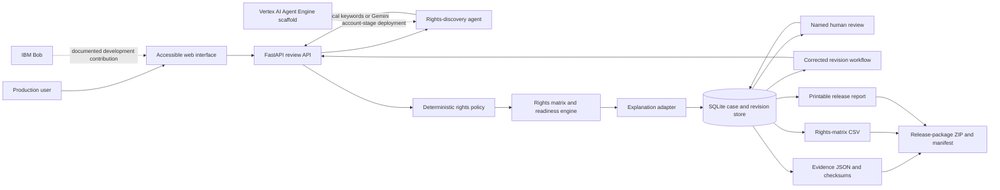

# Architecture diagram source

## Boundary note

The diagram describes CINE-GATE only. It does not represent any unrelated proprietary architecture, enterprise control plane, confidential validation model, or unpublished mechanism.
