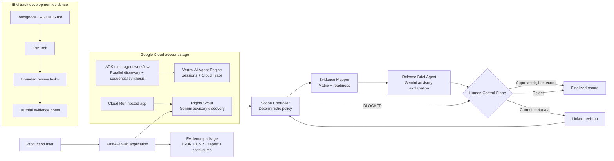

# CINE-GATE Milestone 5 architecture

The ADK workflow is advisory. The FastAPI deterministic policy is the source of the recorded outcome. Unrelated proprietary systems and confidential material are outside the repository and outside the Bob workspace.
